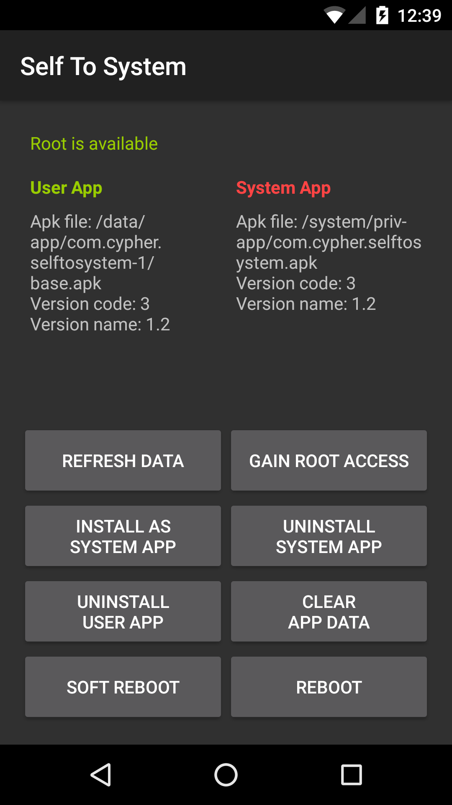

# Self To System

Self To System is a simple Android example app that can install itself as a system app. Its purpose is to demonstrate the capabilities of its core functionality, the SystemAppUtilities class.

The SystemAppUtilities class can be used by any app to make it capable to install itself as a system app. This can be used to extend the apps capabilities and make it resistant to factory resets.

This example app also shows some information about its user and system apk. But it has no practical functionality.

Every button shows an information dialog before doing anything. You can continue or cancel.

If you're interested in making your app capable to install itself as a system app, check out the source code.

The app has been tested on Android 4.1 up to 7.0 using the Genymotion emulator.

Android 4.1.1, 4.2.2, 4.3 and 4.4.4:
* When installing the app as system app, the user app disappears. This is no problem, but it's worth mentioning.
    * When installing the app again, user app and system app are both there.
* If there is only a system app and it gets uninstalled via its inApp functionality, it is copied back to the data partition.
    * When doing so, the app crashes and a reboot has to be done manually.

Android 5.0.0:
* Again, when installing the app as system app, the user app disappears. This is no problem, but it's worth mentioning.
    * When installing the app again, user app and system app are there.
* If there is only a system app and it gets uninstalled via its inApp functionality, it is copied back to the data partition.
    * This time, the app doesn't crash and the device can be rebooted via the popup dialog.

Android 5.1.0, 6.0.0 and 7.0.0:
* When installing the app as system app, the user app stays.
    * When uninstalling the user app via Android settings, the system app stays and works.
    * When uninstalling the user app via its inApp functionality, the system app disappears from the app drawer, even though the apk is still there.

Some of the problems might be related to Genymotion, but they can also occur on other roms, so be careful!

